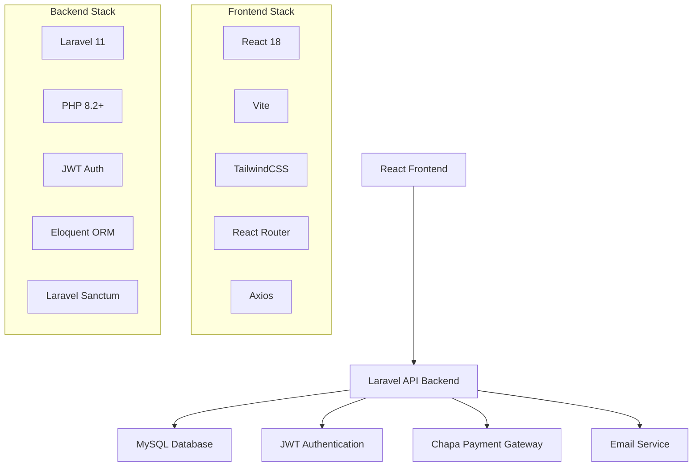

<div align="center">

# 🅿️ MikiPark - Smart Parking Management System

[](https://laravel.com)
[](https://reactjs.org)
[](https://php.net)
[](https://vitejs.dev)
[](https://tailwindcss.com)

**A comprehensive, full-stack parking management solution with real-time reservations, payment integration, and intelligent spot recommendations.**

[🚀 Quick Start](#-quick-start) • [📖 Documentation](#-documentation) • [🛠️ API Reference](#-api-reference) • [🤝 Contributing](#-contributing)

</div>

---

## 📋 Table of Contents

- [✨ Features](#-features)
- [🏗️ Architecture](#️-architecture)
- [🚀 Quick Start](#-quick-start)
- [📦 Installation](#-installation)
- [⚙️ Configuration](#️-configuration)
- [🛠️ Development](#️-development)
- [📖 API Reference](#-api-reference)
- [🧪 Testing](#-testing)
- [🚀 Deployment](#-deployment)
- [🤝 Contributing](#-contributing)
- [📄 License](#-license)

## ✨ Features

### 🎯 Core Functionality
- **Real-time Parking Management** - Live parking spot availability tracking
- **Smart Reservations** - Advanced booking system with time-based reservations
- **Multi-role Access Control** - User, Admin.
- **Payment Integration** - Chapa payment gateway integration
- **Email Verification** - Secure user registration with email confirmation

### 🔧 Technical Features
- **RESTful API** - Clean, documented API endpoints
- **JWT Authentication** - Secure token-based authentication
- **Real-time Updates** - Live status updates for parking spots
- **Responsive Design** - Mobile-first, responsive user interface
- **PDF Generation** - Automated receipt and report generation
- **CORS Support** - Cross-origin resource sharing enabled

## 🏗️ Architecture

### System Overview


### Project Structure
```
MikiPark/
├── 📁 app/                    # Laravel application core
│   ├── Http/Controllers/Api/  # API controllers
│   ├── Models/               # Eloquent models
│   ├── Services/             # Business logic services
│   └── Mail/                 # Email templates
├── 📁 config/                # Configuration files
├── 📁 database/              # Migrations, seeders, factories
│   ├── migrations/           # Database schema
│   └── seeders/              # Sample data
├── 📁 resources/             # Frontend resources
│   ├── js/                   # React application
│   │   ├── components/       # Reusable components
│   │   ├── pages/            # Page components
│   │   ├── contexts/         # React contexts
│   │   └── services/         # API services
│   ├── css/                  # Stylesheets
│   └── views/                # Blade templates
├── 📁 routes/                # Route definitions
│   ├── api.php              # API routes
│   └── web.php              # Web routes
├── 📁 public/                # Public assets
├── 📁 storage/               # File storage
└── 📁 tests/                 # Test suites
```

## 🚀 Quick Start

### Prerequisites Checklist
- [ ] **PHP 8.2+** - [Download PHP](https://www.php.net/downloads)
- [ ] **Composer** - [Install Composer](https://getcomposer.org/download/)
- [ ] **Node.js 18+** - [Download Node.js](https://nodejs.org/)
- [ ] **MySQL/SQLite** - Database server
- [ ] **Git** - Version control

### One-Command Setup
```bash
# Clone and setup the entire project
git clone https://github.com/your-username/MikiPark.git
cd MikiPark
npm run install:all && npm run migrate:fresh && npm run dev
```

🎉 **That's it!** Your application will be running at:
- **Frontend**: http://localhost:5173
- **Backend API**: http://127.0.0.1:8000

## 📦 Installation

### Step-by-Step Installation

<details>
<summary><b>🔧 Manual Installation (Click to expand)</b></summary>

#### 1. Clone the Repository
```bash
git clone https://github.com/your-username/MikiPark.git
cd MikiPark
```

#### 2. Backend Setup
```bash
# Install PHP dependencies
composer install

# Copy environment file
cp .env.example .env

# Generate application key
php artisan key:generate

# Generate JWT secret
php artisan jwt:secret

# Create database (SQLite)
touch database/database.sqlite

# Run migrations and seed data
php artisan migrate:fresh --seed
```

#### 3. Frontend Setup
```bash
# Install Node.js dependencies
npm install

# Build assets for development
npm run build
```

#### 4. Start Development Servers
```bash
# Option 1: Start both servers simultaneously
npm run dev

# Option 2: Start servers individually
npm run dev:backend    # Backend only (port 8000)
npm run dev:frontend   # Frontend only (port 5173)
```

</details>

### 🐳 Docker Installation (Coming Soon)
```bash
# Quick Docker setup (planned feature)
docker-compose up -d
```

## ⚙️ Configuration

### Environment Variables

<details>
<summary><b>📋 Backend Configuration (.env)</b></summary>

```env
# Application
APP_NAME=MikiPark
APP_ENV=local
APP_KEY=base64:your-app-key
APP_DEBUG=true
APP_URL=http://127.0.0.1:8000

# Database
DB_CONNECTION=sqlite
DB_DATABASE=/absolute/path/to/database/database.sqlite

# JWT Authentication
JWT_SECRET=your-jwt-secret
JWT_TTL=1440
JWT_REFRESH_TTL=20160

# Mail Configuration
MAIL_MAILER=smtp
MAIL_HOST=smtp.gmail.com
MAIL_PORT=587
MAIL_USERNAME=your-email@gmail.com
MAIL_PASSWORD=your-app-password
MAIL_ENCRYPTION=tls

# Chapa Payment Gateway
CHAPA_SECRET_KEY=your-chapa-secret-key
CHAPA_PUBLIC_KEY=your-chapa-public-key
```

</details>

<details>
<summary><b>🎨 Frontend Configuration</b></summary>

The frontend configuration is handled through Vite and is automatically configured to work with the Laravel backend. Key configurations:

- **API Base URL**: Automatically configured to `http://127.0.0.1:8000`
- **Authentication**: JWT tokens stored in HTTP-only cookies
- **Routing**: React Router for client-side navigation
- **Styling**: TailwindCSS with custom theme

</details>

### 🔐 Authentication Setup

The system uses JWT (JSON Web Tokens) for authentication:

1. **User Registration** → Email verification required
2. **Login** → JWT token issued and stored in cookies
3. **API Requests** → Token automatically included in headers
4. **Token Refresh** → Automatic token renewal

### 💳 Payment Integration

MikiPark integrates with **Chapa** payment gateway:

1. Add your Chapa credentials to `.env`
2. Configure webhook URLs in Chapa dashboard
3. Test payments in sandbox mode
4. Switch to production when ready

## 🛠️ Development

### Available Scripts

| Command | Description |
|---------|-------------|
| `npm run dev` | 🚀 Start both backend and frontend |
| `npm run dev:backend` | 🔧 Start Laravel API server only |
| `npm run dev:frontend` | ⚡ Start Vite dev server only |
| `npm run build` | 📦 Build frontend for production |
| `npm run test:backend` | 🧪 Run PHP/Laravel tests |
| `npm run migrate` | 🗄️ Run database migrations |
| `npm run migrate:fresh` | 🔄 Reset database with fresh data |
| `npm run seed` | 🌱 Seed database with sample data |

### Development Workflow

1. **Start Development Environment**
   ```bash
   npm run dev
   ```

2. **Make Changes**
   - Backend changes: Edit files in `app/`, `routes/`, `database/`
   - Frontend changes: Edit files in `resources/js/`

3. **Test Changes**
   ```bash
   npm run test:backend
   ```

4. **Database Changes**
   ```bash
   php artisan make:migration create_new_table
   npm run migrate
   ```

## 📖 API Reference

### Authentication Endpoints

<details>
<summary><b>🔐 Auth API Endpoints</b></summary>

| Method | Endpoint | Description | Auth Required |
|--------|----------|-------------|---------------|
| `POST` | `/api/auth/register` | Register new user | ❌ |
| `POST` | `/api/auth/login` | User login | ❌ |
| `POST` | `/api/auth/logout` | User logout | ✅ |
| `GET` | `/api/auth/me` | Get current user | ✅ |
| `POST` | `/api/auth/refresh` | Refresh JWT token | ✅ |
| `POST` | `/api/auth/change-password` | Change password | ✅ |

**Example: User Registration**
```bash
curl -X POST http://127.0.0.1:8000/api/auth/register \
  -H "Content-Type: application/json" \
  -d '{
    "name": "John Doe",
    "email": "john@example.com",
    "password": "password123",
    "password_confirmation": "password123"
  }'
```

</details>

### Parking Management Endpoints

<details>
<summary><b>🅿️ Parking API Endpoints</b></summary>

| Method | Endpoint | Description | Auth Required |
|--------|----------|-------------|---------------|
| `GET` | `/api/parking-spots` | List all parking spots | ❌ |
| `GET` | `/api/parking-spots/{id}` | Get specific parking spot | ❌ |
| `GET` | `/api/parking-spots/available/list` | List available spots | ❌ |
| `POST` | `/api/parking-spots` | Create parking spot | ✅ (Admin) |
| `PUT` | `/api/parking-spots/{id}` | Update parking spot | ✅ (Admin) |
| `DELETE` | `/api/parking-spots/{id}` | Delete parking spot | ✅ (Admin) |
| `GET` | `/api/parking-spots/recommend/{userId}` | Get recommendations | ✅ |

**Example: Get Available Spots**
```bash
curl -X GET http://127.0.0.1:8000/api/parking-spots/available/list
```

</details>

### Reservation Endpoints

<details>
<summary><b>📅 Reservation API Endpoints</b></summary>

| Method | Endpoint | Description | Auth Required |
|--------|----------|-------------|---------------|
| `GET` | `/api/reservations` | List user reservations | ✅ |
| `POST` | `/api/reservations` | Create reservation | ✅ |
| `GET` | `/api/reservations/{id}` | Get reservation details | ✅ |
| `PUT` | `/api/reservations/{id}` | Update reservation | ✅ |
| `DELETE` | `/api/reservations/{id}` | Cancel reservation | ✅ |
| `POST` | `/api/reservations/{id}/checkin` | Check into parking spot | ✅ |
| `POST` | `/api/reservations/{id}/checkout` | Check out of parking spot | ✅ |

</details>

### Response Format

All API responses follow this consistent format:

```json
{
  "success": true,
  "message": "Operation completed successfully",
  "data": {
    // Response data here
  },
  "meta": {
    "pagination": {
      "current_page": 1,
      "total_pages": 5,
      "per_page": 10,
      "total": 50
    }
  }
}
```

## 🧪 Testing

### Running Tests

```bash
# Run all backend tests
npm run test:backend

# Run specific test file
php artisan test tests/Feature/AuthTest.php

# Run tests with coverage
php artisan test --coverage
```

### Test Structure

```
tests/
├── Feature/           # Integration tests
│   ├── AuthTest.php
│   ├── ParkingTest.php
│   └── ReservationTest.php
├── Unit/              # Unit tests
│   ├── UserTest.php
│   └── ParkingSpotTest.php
└── TestCase.php       # Base test class
```

### Writing Tests

Example test for parking spot creation:

```php
public function test_admin_can_create_parking_spot()
{
    $admin = User::factory()->admin()->create();

    $response = $this->actingAs($admin, 'api')
        ->postJson('/api/parking-spots', [
            'spot_number' => 'A001',
            'name' => 'Premium Spot A001',
            'location' => 'Level 1, Section A',
            'price_per_hour' => 5.00
        ]);

    $response->assertStatus(201)
        ->assertJson(['success' => true]);
}
```

## 🚀 Deployment

### Production Deployment

<details>
<summary><b>🌐 Production Setup Guide</b></summary>

#### 1. Server Requirements
- **PHP 8.2+** with extensions: BCMath, Ctype, Fileinfo, JSON, Mbstring, OpenSSL, PDO, Tokenizer, XML
- **MySQL 8.0+** or **PostgreSQL 13+**
- **Node.js 18+** and **npm**
- **Web Server**: Apache or Nginx
- **SSL Certificate** (recommended)

#### 2. Environment Configuration
```bash
# Set production environment
APP_ENV=production
APP_DEBUG=false

# Configure production database
DB_CONNECTION=mysql
DB_HOST=your-db-host
DB_DATABASE=your-db-name
DB_USERNAME=your-db-user
DB_PASSWORD=your-db-password

# Set production URLs
APP_URL=https://your-domain.com
FRONTEND_URL=https://your-domain.com
```

#### 3. Deployment Steps
```bash
# 1. Clone repository
git clone https://github.com/your-username/MikiPark.git
cd MikiPark

# 2. Install dependencies
composer install --optimize-autoloader --no-dev
npm install --production

# 3. Build frontend assets
npm run build

# 4. Configure environment
cp .env.example .env
# Edit .env with production values

# 5. Generate keys and optimize
php artisan key:generate
php artisan jwt:secret
php artisan config:cache
php artisan route:cache
php artisan view:cache

# 6. Run migrations
php artisan migrate --force

# 7. Set permissions
chmod -R 755 storage bootstrap/cache
chown -R www-data:www-data storage bootstrap/cache
```

</details>

### Docker Deployment (Recommended)

```dockerfile
# Dockerfile example (create this file)
FROM php:8.2-fpm

# Install dependencies and extensions
RUN apt-get update && apt-get install -y \
    git curl libpng-dev libonig-dev libxml2-dev zip unzip nodejs npm

# Install PHP extensions
RUN docker-php-ext-install pdo_mysql mbstring exif pcntl bcmath gd

# Install Composer
COPY --from=composer:latest /usr/bin/composer /usr/bin/composer

# Set working directory
WORKDIR /var/www

# Copy application files
COPY . .

# Install dependencies and build
RUN composer install --optimize-autoloader --no-dev
RUN npm install && npm run build

# Set permissions
RUN chown -R www-data:www-data /var/www
```

## 🔧 Troubleshooting

### Common Issues and Solutions

<details>
<summary><b>❌ Backend Issues</b></summary>

**Issue: "Class 'JWT' not found"**
```bash
# Solution: Install and configure JWT
composer require tymon/jwt-auth
php artisan vendor:publish --provider="Tymon\JWTAuth\Providers\LaravelServiceProvider"
php artisan jwt:secret
```

**Issue: "SQLSTATE[HY000] [2002] Connection refused"**
```bash
# Solution: Check database configuration
php artisan config:clear
# Verify DB_* variables in .env file
```

**Issue: "The stream or file could not be opened"**
```bash
# Solution: Fix storage permissions
chmod -R 775 storage
chmod -R 775 bootstrap/cache
```

</details>

<details>
<summary><b>⚡ Frontend Issues</b></summary>

**Issue: "Network Error" when calling API**
```bash
# Solution: Check CORS configuration
# Verify API_BASE_URL in frontend configuration
# Ensure backend server is running on correct port
```

**Issue: "Module not found" errors**
```bash
# Solution: Reinstall dependencies
rm -rf node_modules package-lock.json
npm install
```

**Issue: "Vite build fails"**
```bash
# Solution: Clear cache and rebuild
npm run build:clean
npm run build
```

</details>

### Debug Mode

Enable debug mode for development:

```bash
# Backend debugging
APP_DEBUG=true
LOG_LEVEL=debug

# Frontend debugging
VITE_APP_DEBUG=true
```

### Performance Optimization

```bash
# Backend optimization
php artisan optimize
php artisan config:cache
php artisan route:cache
php artisan view:cache

# Frontend optimization
npm run build
# Enable gzip compression on your web server
```

## 🤝 Contributing

We welcome contributions from the community! Here's how you can help make MikiPark better.

### 🌟 Ways to Contribute

- 🐛 **Report Bugs** - Found a bug? [Open an issue](https://github.com/your-username/MikiPark/issues)
- 💡 **Suggest Features** - Have an idea? [Start a discussion](https://github.com/your-username/MikiPark/discussions)
- 📝 **Improve Documentation** - Help make our docs better
- 🔧 **Submit Code** - Fix bugs or add features via pull requests
- 🧪 **Write Tests** - Help improve our test coverage
- 🌍 **Translate** - Help make MikiPark available in more languages

### 📋 Development Guidelines

<details>
<summary><b>🔧 Code Standards</b></summary>

**PHP/Laravel Standards:**
- Follow [PSR-12](https://www.php-fig.org/psr/psr-12/) coding standards
- Use Laravel best practices and conventions
- Write comprehensive PHPDoc comments
- Follow SOLID principles

**JavaScript/React Standards:**
- Use ESLint and Prettier configurations
- Follow React best practices and hooks patterns
- Use TypeScript for type safety (planned)
- Write meaningful component and function names

**Database Standards:**
- Use descriptive migration and model names
- Follow Laravel naming conventions
- Add proper indexes for performance
- Include rollback methods in migrations

</details>

### 🚀 Getting Started with Contributing

1. **Fork the Repository**
   ```bash
   # Fork on GitHub, then clone your fork
   git clone https://github.com/your-username/MikiPark.git
   cd MikiPark
   ```

2. **Set Up Development Environment**
   ```bash
   npm run install:all
   npm run migrate:fresh
   npm run dev
   ```

3. **Create a Feature Branch**
   ```bash
   git checkout -b feature/amazing-new-feature
   ```

4. **Make Your Changes**
   - Write clean, documented code
   - Add tests for new functionality
   - Update documentation as needed

5. **Test Your Changes**
   ```bash
   npm run test:backend
   # Test frontend manually
   ```

6. **Submit a Pull Request**
   - Write a clear PR description
   - Reference any related issues
   - Ensure all tests pass

### 📝 Commit Message Convention

We use [Conventional Commits](https://www.conventionalcommits.org/):

```
type(scope): description

feat(auth): add password reset functionality
fix(parking): resolve spot availability calculation
docs(readme): update installation instructions
test(api): add reservation endpoint tests
```

### 🏆 Contributors

<a href="https://github.com/your-username/MikiPark/graphs/contributors">
  
</a>

## 📊 Project Status

### 🎯 Current Version: v1.0.0

### ✅ Completed Features
- [x] User authentication and authorization
- [x] Parking spot management
- [x] Reservation system
- [x] Payment integration (Chapa)
- [x] Email verification
- [x] Admin dashboard
- [x] Responsive design
- [x] API documentation

### 🚧 In Progress
- [ ] Mobile app (React Native)
- [ ] Real-time notifications
- [ ] Advanced analytics dashboard
- [ ] Multi-language support

### 🔮 Planned Features
- [ ] IoT sensor integration
- [ ] Machine learning recommendations
- [ ] QR code parking
- [ ] Subscription plans
- [ ] Multi-tenant support

## 📄 License

This project is licensed under the **MIT License** - see the [LICENSE](LICENSE) file for details.

```
MIT License

Copyright (c) 2024 MikiPark

Permission is hereby granted, free of charge, to any person obtaining a copy
of this software and associated documentation files (the "Software"), to deal
in the Software without restriction, including without limitation the rights
to use, copy, modify, merge, publish, distribute, sublicense, and/or sell
copies of the Software, and to permit persons to whom the Software is
furnished to do so, subject to the following conditions:

The above copyright notice and this permission notice shall be included in all
copies or substantial portions of the Software.
```

---

<div align="center">

### 🙏 Thank You for Using MikiPark!

**Made with ❤️ by the MikiPark Team**

[⭐ Star this repo](https://github.com/your-username/MikiPark) • [🐛 Report Bug](https://github.com/your-username/MikiPark/issues) • [💡 Request Feature](https://github.com/your-username/MikiPark/issues)

**Connect with us:**
[](https://github.com/your-username)
[](https://linkedin.com/in/your-profile)
[](https://twitter.com/your-handle)

</div>
```
```
